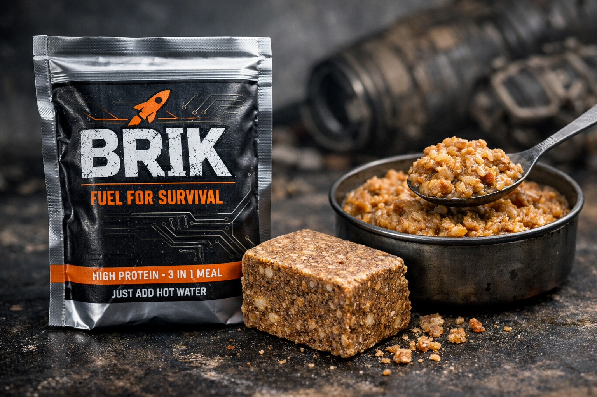

# 🦾 PROJECT: BRIK — FUEL YOUR SURVIVAL 🚀

Забивают скот? Забудь про скучные протеиновые батончики и дедушкины рецепты из шкур бизона.  
Мы входим в эру **Cyberpunk Nomad Cuisine**.

Представляем **BRIK** — концентрированный хаос, калории и дошик в одном кубике.  
Это как кофе 3-в-1, только вместо бодрости он даёт тебе режим **«бессмертия»** на ближайшем марш-броске  
(или рейде по ночному городу).

---

## 💡 КОНЦЕПЦИЯ: *Cyber-Pemmican 2.0*

BRIK — это союз древних технологий индейцев и святого духа быстрорастворимой лапши.

- **B — Beef**  
  Говядина из «Перекрестка», выжившая в духовке  

- **R — Ramen**  
  Тот самый дошик, измельчённый в пыль  

- **I — Instant**  
  Залил кипятком — и ты в раю  

- **K — Kalories**  
  Столько жира гхи, что твой метаболизм скажет «Ой!»  

---

## 🛠 ИНЖЕНЕРНЫЙ РЕЦЕПТ (СХЕМА СБОРКИ)

### 1. Фаза «Мясо»
Берём говяжий фарш (не жирный, мы же эстеты).  
Закидываем в духовку на **70°C**.  
Сушим до состояния **«каменная крошка»**.  

> Если об него можно сломать зуб — значит, готово.

---

### 2. Фаза «Ускоритель»
Берём пачку дошика.  
Извлекаем лапшу и крошим её в пыль, как надежды на выходной.  

Специи из пакетика не выкидываем —  
это наш **ядерный реактор вкуса**.

---

### 3. Фаза «Связующее»
Топим масло гхи.  

> Это наше **жидкое золото**.

---

### 4. Слияние
Смешиваем:
- мясные камни  
- крошево дошика  
- специи  

Заливаем маслом гхи до состояния **густой шпатлёвки**.

---

## 📦 ФОРМ-ФАКТОР

Запрессовываем массу в прямоугольную форму  
(пластиковый контейнер или фольга).

После застывания у тебя в руках — **BRIK**  
Тяжёлый. Плотный. Надёжный.

---

## ⚙️ КАК ИСПОЛЬЗОВАТЬ

### 🔥 Вариант «Хардкор»
Просто грызи его, глядя в закат.  
Твои челюсти станут стальными.

---

### 🍜 Вариант «Люкс»
Кидай BRIK в кружку → заливай кипятком  

Через 3 минуты у тебя:
> густой, наваристый суп-пюре  
> **«Погибель фудблогера»**

---

## ⚠️ WARNING

- Не пытайтесь сканировать BRIK антивирусом  
- Уровень нажористости: **99 lvl**  
- Срок годности: переживёт твой роутер и, возможно, цивилизацию  

---

# ⚡️ BRIK — ЕШЬ КАК КОЧЕВНИК, ЖИВИ КАК КИБЕРПАНК 🥩🍜

---

## ❓ NEXT STEP

- [ ] Собрать тестовый брикет  
- [ ] Посчитать калорийность  
- [ ] Оптимизировать состав  
- [ ] Дизайн упаковки (фольга + скотч + стиль)

> Готов перейти на следующий уровень?